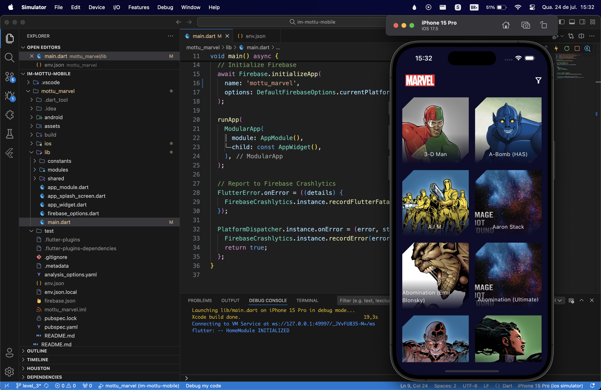

# Teste Mottu

Aplicativo desenvolvido para o teste técnico da Mottu utilizando a api Marvel.

Projeto baseado nos princípios da arquitetura limpa com a utilização do BLOC para gerencia de estado e flutter modular para injeção de dependencia e gerenciamento de rotas.

## Pacotes Utilizados:

- crypto (Gerar o hash md5 utilizado pela api)
- dio (Requisições http)
- firebase_crashlytics (análise de erros)
- flutter_bloc (Gerenciamento de estado)
- flutter_modular (Injeção de dependencia e gestão de rotas)
- result_dart (Pacote auxiliar para programação funcional)
- shared_preferences (Armazenamento do cache da api)

## Segue a lista de itens realizados:

### NÍVEL 1 - nome da branch (level_1):

- [x] Executar etapas iniciais;
- [x] Mostrar a listagem dos personagens (imagem e nome);
- [x] Ação de clique nos cards da listagem e exibir os detalhes (imagem, nome e descrição);

### NÍVEL 2 - nome da branch (level_2):

- [x] Executar etapas iniciais;
- [x] Guardar em cache as consultas realizadas na API Marvel;
- [x] Mostrar a listagem dos personagens (imagem e nome);
- [x] Criar um filtro para a listagem;
- [x] Ação de clique nos cards da listagem e exibir os detalhes (imagem, nome, descrição e personagens relacionados);

### NÍVEL 3 - nome da branch (level_3):

- [x] Executar etapas iniciais;
- [x] Criar uma Splashscreen customizada;
- [x] Guardar em cache as consultas realizadas na API Marvel;
- [x] Limpar cache de consultas no fechamento do APP;
- [x] Mostrar a listagem dos personagens (imagem e nome);
- [x] Criar um filtro para a listagem;
- [x] Criar uma paginação da listagem;
- [x] Ação de clique nos cards da listagem e exibir os detalhes (imagem, nome, descrição e personagens relacionados);
- [x] Ação de clique nos personagens relacionados e exibir os detalhes (imagem, nome, descrição e personagens relacionados);
- [ ] Criar testes de unidade das regras de negócio;

---

# Screenshots do projeto

  

  
    

